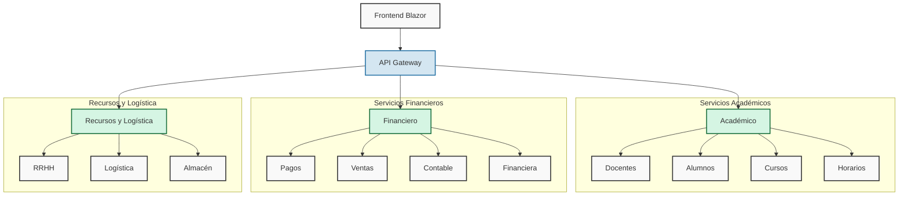

```mermaid
flowchart TB
    FE[Frontend Blazor] --> AG[API Gateway]
    AG --> A[Académico]
    AG --> F[Financiero]
    AG --> R[Recursos y Logística]
    
    subgraph Academico[Servicios Académicos]
        A --> D[Docentes]
        A --> AL[Alumnos]
        A --> C[Cursos]
        A --> H[Horarios]
    end
    
    subgraph Financiero[Servicios Financieros]
        F --> P[Pagos]
        F --> V[Ventas]
        F --> CO[Contable]
        F --> FI[Financiera]
    end
    
    subgraph Recursos[Recursos y Logística]
        R --> RH[RRHH]
        R --> L[Logística]
        R --> AM[Almacén]
    end

    classDef default fill:#f9f9f9,stroke:#333,stroke-width:2px
    classDef gateway fill:#d4e6f1,stroke:#2874a6
    classDef module fill:#d5f5e3,stroke:#196f3d
    
    class AG gateway
    class A,F,R module
```